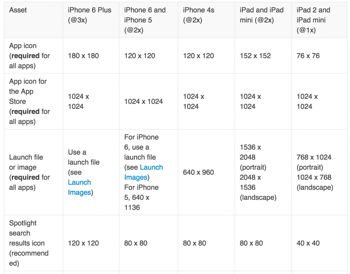

<<<<<< [返回iOS Development Documents](../README.md)

# iOS8官方推荐图标和图像尺寸

### 图标和图像大小

每一个应用程序需要一个应用程序图标和启动图像。此外，一些应用程序需要自定义的图标来表示特定于应用程序的内容，功能，或在导航栏，工具栏和标签栏模式。

 
 
所有图像和图标，PNG格式的建议。你应该避免使用隔行扫描的PNG图像。
图标和图像的标准位深度为24位，8位分别为红，绿，蓝加一个8位的alpha通道。
你并不需要限制你的网页安全色调色板。

# iOS7官方推荐图标和图像尺寸 

### 图标和图像大小

每一个应用程序需要一个应用程序图标和启动图像。此外，一些应用程序需要自定义的图标来表示特定于应用程序的内容，功能，或在导航栏，工具栏和标签栏模式。

不像其他的定制艺术品在您的应用程序的图标和图像，表38-1列出必须满足特定的标准，因此，IOS可以正确显示。此外，一些图标和图像文件的命名要求。（如果你需要支持标准分辨率的iPhone或iPod touch设备，除以2下面列出高分辨率的大小。）



所有图像和图标，PNG格式的建议。你应该避免使用隔行扫描的PNG图像。


图标和图像的标准位深度为24位，8位分别为红，绿，蓝加一个8位的alpha通道。


你并不需要限制你的网页安全色调色板。 

