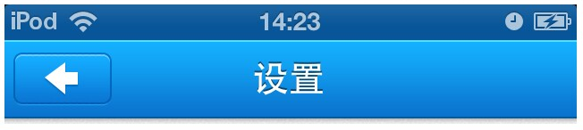

<<<<<< [返回iOS Development Documents](../README.md)

#iOS切图需求规范

---
###1、基本尺寸

| 手机（iPhone）  | 分辨率（px）                |   PPI   |           备注                |
| ------------- |:-------------------------:| :------:|------------------------------:|
| 4、4s          | 640x960                   |   326  | 2x切图(以640为宽度尺寸为基准切图)   |
| 5、5c、5s      | 640x1136                  |   326  | 2x切图(以640为宽度尺寸为基准切图)   |
| 6、6s          | 750x1334                  |   326  | 2x切图(以640为宽度尺寸为基准切图)   |
| 6Plus、6sPlus  | （1242x2208 ->）1080x1920  |   401  |  3x切图(以1280为宽度尺寸为基准切图)|

---
###2、图形部件及字体

（1）为显示清晰

* 所有图形尺寸必须为偶数
* 样式中的阴影、发光、描边的数值也必须为偶数

（2）为方便用户点击

* 所有可点击部件需大于88px * 88px
* 若图片本身不够，可在切图时补足空白像素，例如：

  
（3）为减少程序体积

* 建议尽量使用可平铺图案设计界面

（4）苹果默认字体

* 在PC上没有完全一样的字体，Hiragino Sans GB苹果丽黑最相近，一般做效果图时，用Hiragino Sans GB（包括中英文）代替即可，也可以用方正黑体代替。
* 所有字体使用偶数字号进行设计
* 苹果丽黑有W3、W6两种粗细的字体，例如：

（5）系统可以做到如下字体效果

即，向特定方向1px（做效果图时做2px的效果）投影，需给出字体颜色、阴影颜色。一般不建议按钮上的字体做特殊效果。如果有必要，需将字体和按钮一起切图。
（6）导航栏中的文字一般为40点W6

---
###3、切图提示
（1）所有切图必须为偶数
先根据Retina屏幕切图（即640x960、640x1136、1536x2048），后将切图缩为普通屏幕尺寸。（有特殊图片需要单独制作）

（2）可平铺部件切图时，可如下图：

带圆角按钮切图时，可如下图：

其他部件，同理如下图：

并在效果图中标出具体大小。

（3）导航栏和标签栏下的阴影程序可以自动生成，可不切，如图：

若不满意默认阴影效果，可以单独切2px宽的阴影，如图：

如有异形阴影，例如图：

需切整条阴影，并标注说明。

`说明：所有阴影效果最好可直接切出带阴影效果的切图。`

（4）所有按钮需有两种状态：正常状态、按下状态

（5）一般情况下切图格式为png24

* 如个别图片 jpg 比 png 小很多，可用jpg。
* 但欢迎页、icon必须为png，在不影响显示效果的前提下，可以考虑用png8。

---
###4、命名

（1）图片命名后缀

* 根据Retina屏幕的切图文件名后加@2x，普通屏幕尺寸不用加。
* 适用于iPhone6Plus、iPhone6s Plus的切图文件名后加@3x。
* 欢迎页、背景等需要对iPhone5另外切图，文件名后加-568h@2x。

（2）命名建议

建议采用如下方法命名，如

例如：

* Retina屏幕切图

* 普通屏幕切图

---